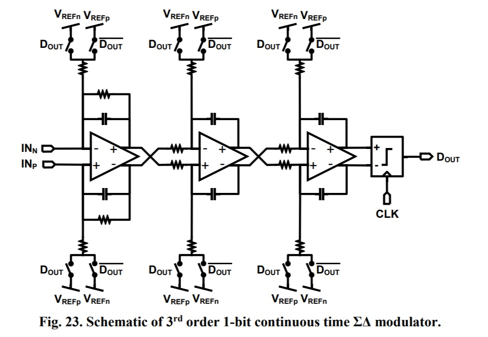
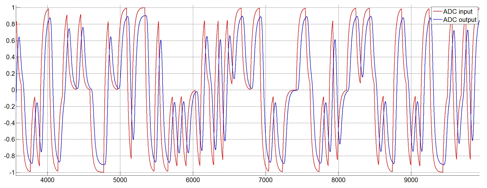
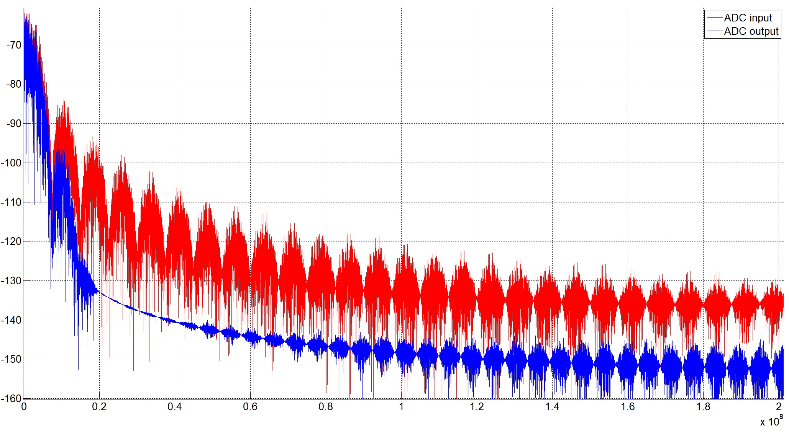

# CTSD-ADC

Сейчас здесь один скрипт на Матлаб, описывающий функционирование АЦП и результаты его работы (диаграммы во временной и частотной области)

Далее скрипт будет уточнятся, для определения параметров аналоговой и цифровой части.

При благоприятном сценарии будет разработана схема и топология для этого АЦП

---
### Примерная схема аналоговой части (тут 3й порядок, в скрипте сейчас сделан 2й)

---
[Cхема взята отсюда (click), и служит исключительно для пояснения](https://deepblue.lib.umich.edu/bitstream/handle/2027.42/138763/bdayanik_1.pdf)
---

### Ожидаемые характеристики

Характеристика              | Значение
----------------------------|-----------
Полоса пропускания          | ~3-4 МГц
SNDR                        | ~ 55dB
Максимальное смещение       | 0.25В
Ошибка усиления             | не специфицируется
Амплитуда входного дифференциального сигнала | 1В, 2.4В
Порядок фильтра в аналоговой части           | 2-3
Дискретизация                                | 1 бит
Рабочая частота                              | ~400 - 500МГц
Питание | 3.3В
Технология | 180нм XFAB
Потребление и площадь | нужны небольшие:)

---

## Текущие результаты работы скрипта
#### Спигнал до и после АЦП

#### Спектр до и после АЦП

